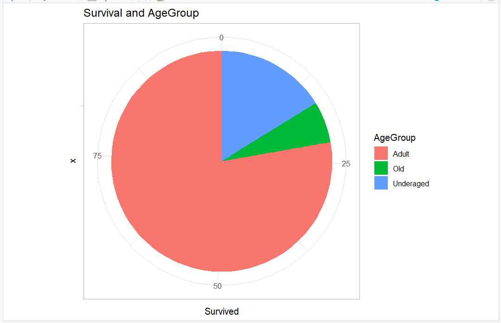
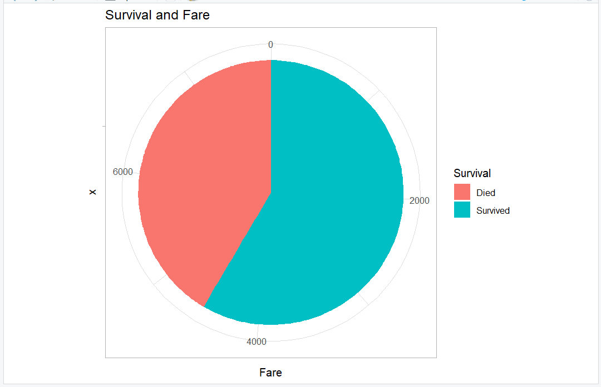
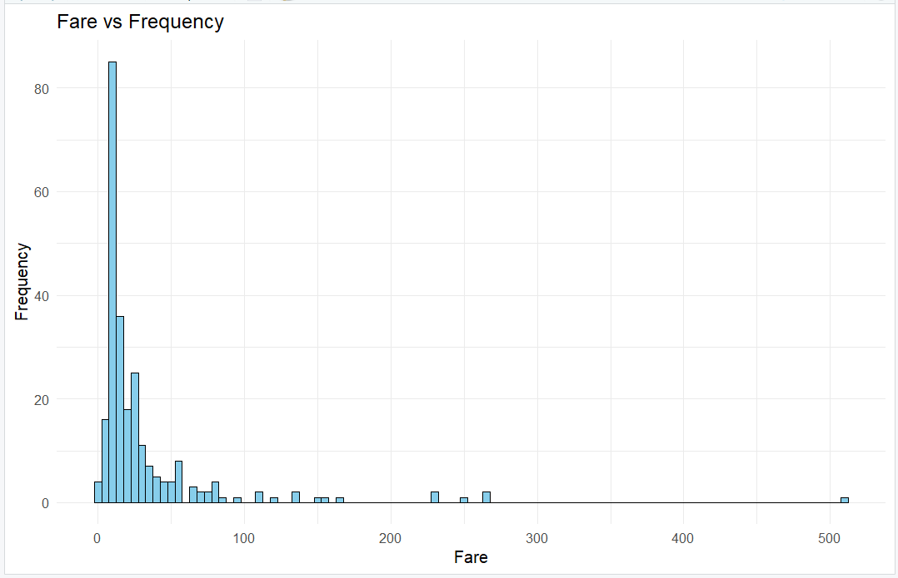
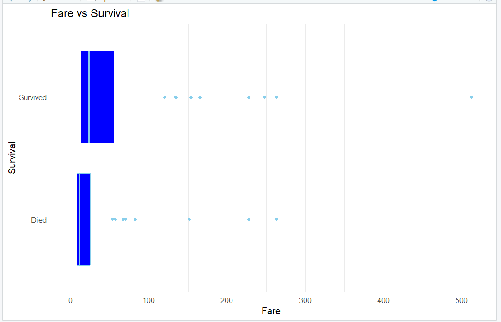
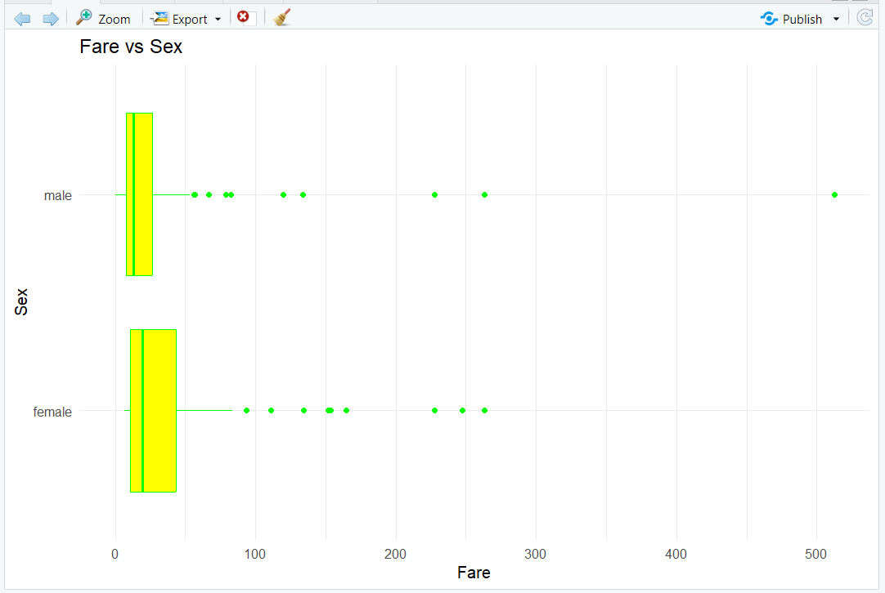
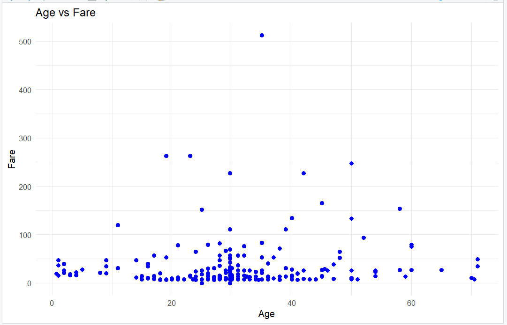
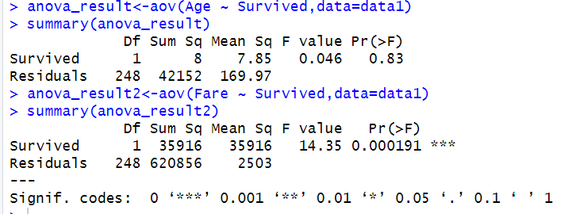

# Titanic Survival Analysis: Exploratory Data Analysis (EDA)

This project performs a comprehensive exploratory analysis of the Titanic dataset using **R** and **ggplot2**. The study focuses on identifying key predictors of survival through data cleaning, feature engineering, and statistical hypothesis testing.

---

## 📊 Key Findings & Visualizations
All visualizations are generated using `ggplot2` and can be found in the `/results` directory.

### 1. Survival & Demographic Distribution
These charts visualize how survival rates varied across different age groups and genders.

| Survival by Age Group | Survival by Fare |
|:---:|:---:|
|  |  |
| *Proportion of survival across age categories.* | *Proportion of survival based on fare brackets.* |

### 2. Economic & Fare Analysis
We analyzed the distribution of fares and their relationship with passenger characteristics to determine if "wealth" influenced survival.

* **Fare Distribution:** 
* **Fare vs. Survival:** 
* **Fare vs. Sex:** 

### 3. Age and Fare Correlations
Examining the relationship between passenger age and the ticket price paid.


*Figure 3: Scatterplot showing the distribution of age against ticket price.*

---

## 🔬 Statistical Analysis
Unlike basic EDA, this project includes rigorous statistical testing to validate observations.

### ANOVA Results
We performed a **One-Way Analysis of Variance (ANOVA)** to test whether the means of `Age` and `Fare` differed significantly between survivors and non-survivors.


*Summary of statistical significance for numerical features.*

---

## 🚀 Analysis Workflow
1.  **Data Cleaning:** Handled missing values in the `Age` column using mean imputation to maintain dataset integrity.
2.  **Feature Engineering:** * Created `AgeGroup` bins (e.g., Child, Adult, Senior).
    * Categorized `Survival` for better visualization labeling.
3.  **Visualization:** Leveraged `ggplot2` for high-quality boxplots, scatterplots, and pie charts.
4.  **Inference:** Used statistical tests to confirm that Fare was a highly significant predictor of survival.

## 📂 Repository Structure
* **`TitanicAnalysis.R`**: The main R script containing data processing and plotting code.
* **`results/`**: Comprehensive directory containing 11+ analytical plots.
* **`data/`**: Source Titanic dataset (CSV).

## 🛠️ Requirements
To run this analysis, you will need **R** and the following libraries:
```r
install.packages("ggplot2")
install.packages("dplyr")
